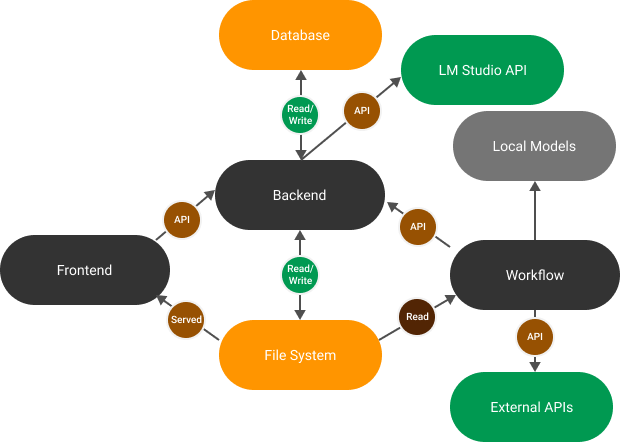

# P.I.K.A.: Advanced AI Workflow and Cognitive Engine

P.I.K.A. is a flexible framework built for intelligent task execution and conversational workflows. It empowers users to create, manage, and deploy AI agents seamlessly by leveraging a microservices architecture and MongoDB for robust data storage.

> **What's New in v0.3**:
>
> - **RAG**: Introduced Retrieval Tasks for prompt-based searches in Data Clusters, returning the most relevant chunks. Supports embedding entire Data Clusters as well.
> - **HITL**: Human-in-the-loop (HITL) functionality allows you to insert User Checkpoints to pause tasks or chats at specific nodes for user intervention.
> - **COT**: Chain-of-Thought (COT) implementation uses `[analysis]` tags in prompts to enhance agents’ reasoning capabilities.
> - **DOCUMENTS**: Agents now parse `[pikaDocument]` tags to better structure their responses.
> - **NODE FLOW**: Fully implemented node execution logic for tasks, simplifying workflows into clear, interconnected nodes.
> - **FLOW VIEWER**: Task UI now provides detailed views of task logic and execution flow.
> - **PROMPT PARSER**: Dynamically visualize templated prompts to understand how agents process input.
> - **APIs**: Added integrations for Wolfram Alpha, Google Knowledge Graph, PixArt Image Generation (local), and Bark TTS (local). Local embedding support included.
> - **DATA CLUSTERS**: Chats and tasks now support updatable Data Clusters to store embeddable items like messages, files, or task outputs. Retrieval Tasks utilize these clusters for contextual data.
> - **TEXT MANAGEMENT**: Two new text-splitting methods (recursive and semantic) improve embeddings and RAG workflows. A Message Pruner helps manage context size in LLMs.
> - **REDIS QUEUE**: Added a Redis-based queuing system to support concurrent task execution in workflows.

> **Note**: Updating to v0.3 requires reinitializing your database. Navigate to `User Settings > Danger Zone` to reinitialize. As P.I.K.A. is in Alpha, frequent updates and changes should be expected.

## Version Updates

### **v0.3.5**

- **Backend**:
  - Updated LM Studio manager (requires build `0.3.5 9-H` to match SDK changes).
  - Optimized routes with `populated` endpoints to reduce frontend memory usage.
- **Frontend**:
  - Improved memory handling for large datasets.
  - Added Context % estimation in the chat interface.
  - Implemented API validation checks for tasks and chats.
  - Enhanced item menus with functions for download, copy, duplicate, delete, and edit.
- **Workflow Module**:
  - Refined backend communication and improved task execution logic.

### **v0.3.10 & v0.3.11**

- **Encryption**: References are now encrypted; database restart required for updates.
- **Threads**: Chats now support multiple threads, allowing separate conversations within a single chat. Threads can also be shared between chats for cross-agent collaboration.
- **Admin Role**: Added admin capabilities for managing users and API keys.

---

## Planned Features for v0.4

- **Computer-based agents** for automating system-level tasks.
- **Communication APIs**, including Gmail and potential messaging integrations.
- **Recurring Tasks** to enable periodic workflow execution and data aggregation.
- **CUDA Support** to run local models in workflows more efficiently.
- **Context Management** with LLMs to summarize and deduplicate long messages.

---

## Project Architecture

P.I.K.A. is built with three primary components:

1. **Backend (Node.js with TypeScript)**:
   - Handles database interactions (MongoDB), file system management, and integrations like LM Studio.
2. **Workflow Module (Python with Pydantic)**:
   - Manages task logic, API interactions, and execution workflows. It communicates with the backend and database.
3. **Frontend (React with TypeScript)**:
   - Provides the user interface for managing workflows, visualizing tasks, and interacting with agents.



---

## Goals

1. Deliver a platform for creating, testing, and deploying agent-driven workflows.
2. Provide a text-based framework where human language is the primary input and output.
3. Support a model-agnostic architecture, allowing users to integrate preferred AI models.
4. Offer an open-source framework that ensures full user control over workflows and data.

---

## Setup and Installation

1. Ensure **Git** and [**Docker**](https://docs.docker.com/engine/install/) are installed. On Windows, Docker Compose is included by default. Verify its presence with [this guide](https://stackoverflow.com/questions/72928891/how-can-i-check-if-docker-compose-plugin-is-installed). For Linux, follow [these steps](https://docs.docker.com/compose/install/linux/).
2. *(Optional)* Install [**LM Studio**](https://lmstudio.ai/) for local model support. Using an incompatible version may result in errors. Recommended build: `0.3.5 9-H`.
3. Clone the repository:

   ```bash
   git clone https://github.com/YourRepo/pika.git
4. Create an .env file in the root directory using template.env as a reference. Fill in API keys (e.g., OpenAI) as needed.
5. Run the appropriate script for your operating system:
Windows: Run run.bat

Linux/Mac: Run run.sh Alternatively, execute the script directly:
python run.py

Framework Overview
P.I.K.A. revolves around four key components:

1. APIs: Integrate with external services for data and processing.
2. Agents: Use models and prompts to process input and generate output.
3. Tasks: Combine agents, APIs, and other tasks to perform specific actions.
4. Chats: Provide conversational interfaces powered by tasks and agents.

## Task Execution

Tasks consist of interconnected "nodes" that define execution logic. Each task starts with a designated start_node and follows the routing defined in node_end_code_routing.

Task Types
API Tasks: Interact with external services such as Google Search or Wikipedia.
Prompt Agent Tasks: Use prompts and LLMs for advanced logic execution, including:
Code Execution: Executes code blocks in Docker containers.
Code Generation: Ensures output includes required code blocks.
Workflows: Chains multiple tasks to form complex processes.

MIT License

Copyright (c) 2025 P.I.K.A.

Permission is hereby granted, free of charge, to any person obtaining a copy of this software and associated documentation files (the "Software"), to deal in the Software without restriction, including without limitation the rights to use, copy, modify, merge, publish, distribute, sublicense, and/or sell copies of the Software, and to permit persons to whom the Software is furnished to do so, subject to the following conditions:

The above copyright notice and this permission notice shall be included in all copies or substantial portions of the Software.

THE SOFTWARE IS PROVIDED "AS IS", WITHOUT WARRANTY OF ANY KIND, EXPRESS OR IMPLIED, INCLUDING BUT NOT LIMITED TO THE WARRANTIES OF MERCHANTABILITY, FITNESS FOR A PARTICULAR PURPOSE AND NONINFRINGEMENT. IN NO EVENT SHALL THE AUTHORS OR COPYRIGHT HOLDERS BE LIABLE FOR ANY CLAIM, DAMAGES OR OTHER LIABILITY, WHETHER IN AN ACTION OF CONTRACT, TORT OR OTHERWISE, ARISING FROM, OUT OF OR IN CONNECTION WITH THE SOFTWARE OR THE USE OR OTHER DEALINGS IN THE SOFTWARE.
